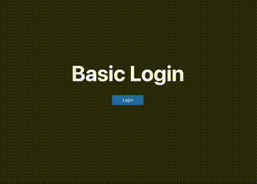

# Altera Full Stack Coding Interview
If you are having a full-stack interview at Altera, we would like to ask you to use the prepared workspace to implement a **React-based** website with the following requirements.

The exercise consists of 2 parts. It would be best to use a computer to access the code. Once you are finished, please generate a patch file and send it to us (instructions below). Here are some of the things we'll be looking for in your code.
- Will you be able to setup a workflow with the code and instruction?
- Can you use the documentation provided to complete the exercie?
- Is the functionality completed, does it actually work?
- Can you maintain good project hygiene, treating this like "real world" software that you would want to maintain in perpetuity?

We’re eager to explore your familiarity with the software development lifecycle, your adeptness at navigating and implementing modern technologies (including tools like ChatGPT), and your ability to initiate and build a software system independently.

## Exercise (Part 1)

This repo provides a backend which support basic authentication. It will accept a Google authorization token and exchange it to a session cookie for a UI.

Please setup a **React** UI that replicates the functionalities shown below. This would require setting up basic authentication with Google and call the appropriate API calls. *There is no need to match the CSS on the given demo*



## Exercise (Part 2)

Make this a message board so that any logged in user can leave messages. It should have the following functionaity.
- After login, user can see their own messages and all other user's messages.
- Users can delete their own messages after posted.
- Users can post messages after login.

You are welcome to use static data on the UI for this part. If you are able to update the DB schema and API to support the functionality, please also include the change in your path.

## Submitting your code

Please run `bash generate_patch.sh` in your commandline to generate a patch file. If you run into any problems of have questions, feel free to reach out and ask!

## Instructions

### Server Setup
The server requires [Redis](https://redis.io/docs/install/install-redis/), [PostgreSQL](https://www.postgresql.org/) and [Go](https://go.dev/) to run.

#### Run instruction
- Start Redis with default port (6379)
- Start PostgreSQL server with default port (5432)
- Build server and run
    ```bash
    cd server
    make all
    ./builds/server
    ```

#### First time usage
- Run `.builds/util` to instantiate the SQL DB.


#### APIs

APIs between the server and UI can be found in the [here](./postman_collection.json) file.


